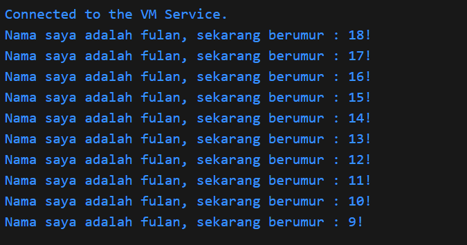
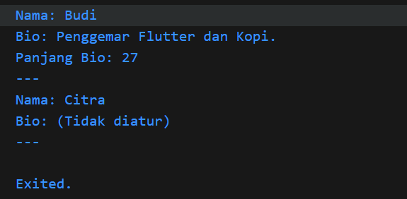
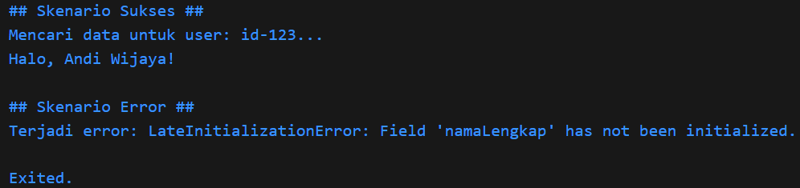

Soal 1
Modifikasilah kode pada baris 3 di VS Code atau Editor Code favorit Anda berikut ini agar mendapatkan keluaran (output) sesuai yang diminta!

Output yang diminta (Gantilah Fulan dengan nama Anda):

Soal 2
Mengapa sangat penting untuk memahami bahasa pemrograman Dart sebelum kita menggunakan framework Flutter ? Jelaskan!

karena Dart adalah fondasi dan otak di balik semua yang Anda lakukan di Flutter. 

Soal 3
Rangkumlah materi dari codelab ini menjadi poin-poin penting yang dapat Anda gunakan untuk membantu proses pengembangan aplikasi mobile menggunakan framework Flutter.

https://docs.google.com/document/d/1lWKBAYSSFsJNLxPN-kTYionsCUqSsHKT5NwJWXgp_1Q/edit?tab=t.0

Soal 4
Buatlah penjelasan dan contoh eksekusi kode tentang perbedaan Null Safety dan Late variabel !

Null Safety adalah fitur fundamental di Dart yang mengubah aturan dasar variabel. Secara default, semua variabel tidak boleh bernilai null (non-nullable). Tujuannya adalah untuk menangkap potensi null pointer error saat penulisan kode (compile-time), bukan saat aplikasi berjalan (runtime).
Untuk membuat sebuah variabel bisa bernilai null, Anda harus secara eksplisit memberitahu Dart dengan menambahkan tanda tanya (?) setelah tipe datanya.

Konsep Kunci Null Safety:
Non-Nullable (Default): String nama; → Variabel nama wajib punya nilai dan tidak boleh null.
Nullable (Opsional): String? bio; → Variabel bio boleh bernilai null.
Pemeriksaan Wajib: Jika sebuah variabel bersifat nullable (?), Dart akan memaksa Anda untuk memeriksa apakah nilainya null sebelum Anda bisa menggunakan properti atau metodenya.

code :\Mobile_Ganjil_2025\week_1\bin\null_safety.dart

Gambar : 

Late variable
Kata kunci late digunakan pada variabel non-nullable yang tidak bisa diinisialisasi langsung saat dideklarasikan, tetapi Anda menjamin bahwa variabel tersebut akan memiliki nilai sebelum pertama kali diakses.

Ini adalah cara Anda berkata kepada sistem Null Safety: "Percayalah padaku, variabel ini tidak akan null saat akan dipakai. Saya akan mengisinya nanti."

Kapan Menggunakan late?
Inisialisasi di initState: Sangat umum di Flutter, di mana variabel diinisialisasi di dalam method initState().
Inisialisasi Malas (Lazy Initialization): Untuk variabel yang proses pembuatannya berat dan Anda hanya ingin membuatnya saat benar-benar dibutuhkan untuk pertama kali.

Code : \Mobile_Ganjil_2025\week_1\bin\late_variable.dart

Gambar Hasil : 
Kumpulkan jawaban Anda kepada dosen pengampu sesuai kesepakatan di kelas.