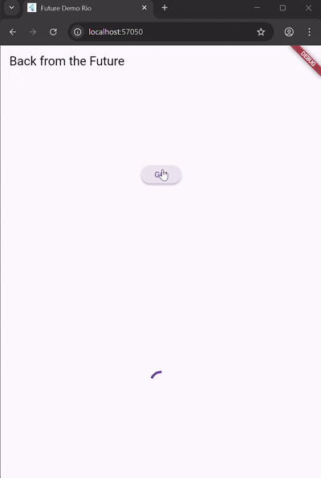
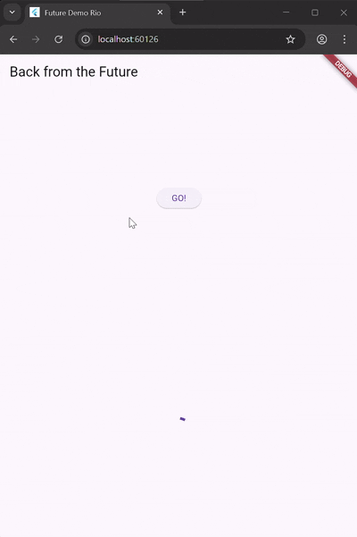
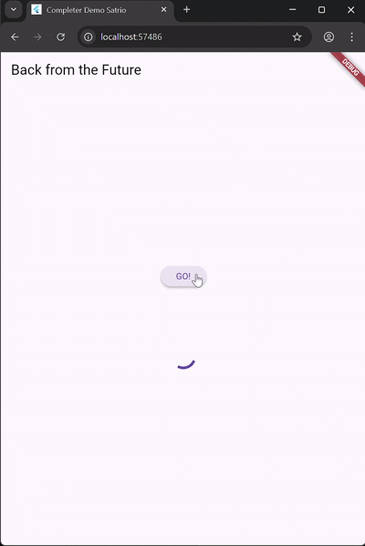
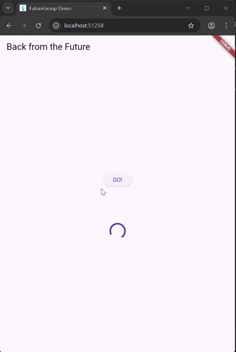
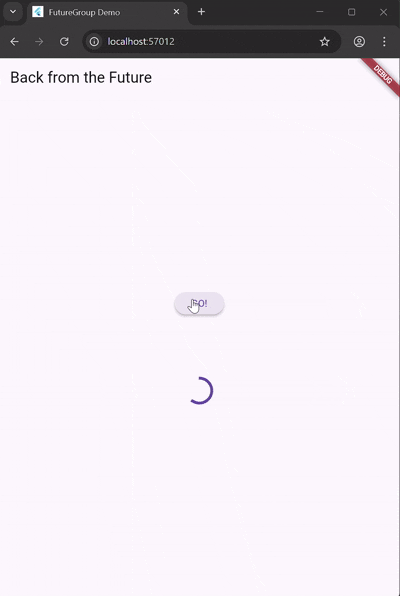
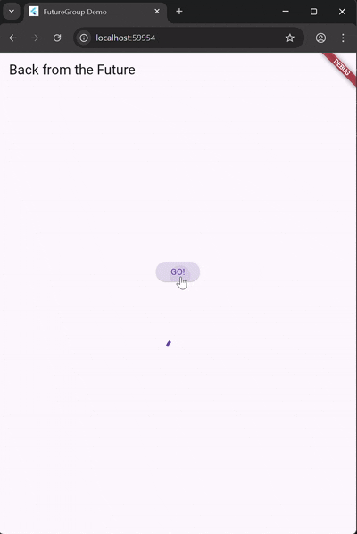
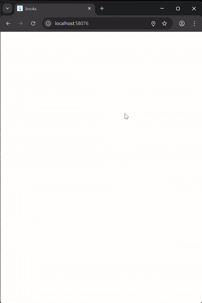
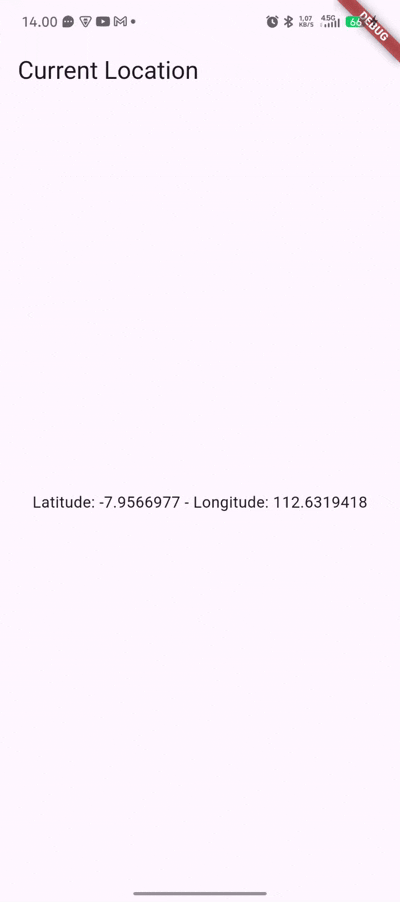
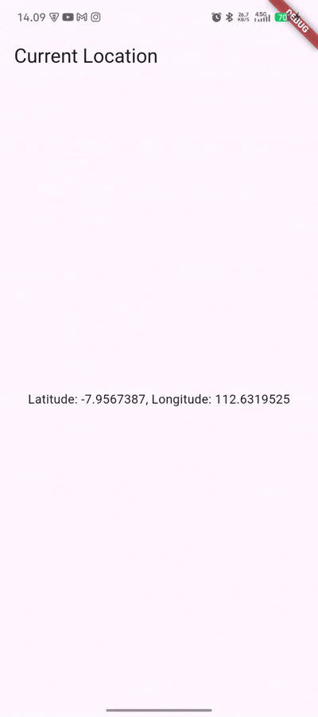

# Laporan Jobsheet 11

## Pemrograman Asynchronous Flutter

  - **Nama :** Satrio Ahmad Ramadhani
  - **NIM :** 2341720163
  - **Kelas :** TI-3H


## Praktikum 1

### 1. Membuat Project dan Kode Dasar

- Membuat project baru Flutter bernama **books** di folder **src week-11** repository GitHub Anda.
- Menambahkan dependency `http` pada `pubspec.yaml` dengan perintah berikut:
  ```
  flutter pub add http
  ```
- Pastikan file `pubspec.yaml` sudah menampilkan dependensi berikut:
  ```
  dependencies:
    flutter:
      sdk: flutter
    http: ^1.1.0
  ```

### 2. Source Code Praktikum

```dart
import 'dart:async';
import 'package:flutter/material.dart';
import 'package:http/http.dart';
import 'package:http/http.dart' as http;

void main() {
  runApp(const MyApp());
}

class MyApp extends StatelessWidget {
  const MyApp({super.key});

  @override
  Widget build(BuildContext context) {
    return MaterialApp(
      title: 'Future Demo',
      theme: ThemeData(
        primarySwatch: Colors.blue,
        visualDensity: VisualDensity.adaptivePlatformDensity,
      ),
      home: const FuturePage(),
    );
  }
}

class FuturePage extends StatefulWidget {
  const FuturePage({super.key});

  @override
  State<FuturePage> createState() => _FuturePageState();
}

class _FuturePageState extends State<FuturePage> {
  String result = '';
  @override
  Widget build(BuildContext context) {
    return Scaffold(
      appBar: AppBar(title: const Text('Back from the Future')),
      body: Center(
        child: Column(
          children: [
            const Spacer(),
            ElevatedButton(child: const Text('GO!'), onPressed: () {}),
            const Spacer(),
            Text(result),
            const Spacer(),
            const CircularProgressIndicator(),
            const Spacer(),
          ],
        ),
      ),
    );
  }

  Future<Response> getData() async {
    const authority = 'www.googleapis.com';
    const path = '/books/v1/volumes/i9PvStUdWz8C';
    Uri url = Uri.https(authority, path);
    return http.get(url);
  }
}
```

---

## Soal Praktikum

### Soal 1

Tambahkan **nama panggilan Anda** pada `title` app sebagai identitas hasil pekerjaan.

    return MaterialApp(
      title: 'Future Demo Rio',
      theme: ThemeData(
        primarySwatch: Colors.blue,
        visualDensity: VisualDensity.adaptivePlatformDensity,
      ),
      home: const FuturePage(),
    );

### Soal 2

- Cari judul buku favorit Anda di Google Books, lalu ganti ID buku pada variabel `path` di kode tersebut. Caranya ambil di URL browser seperti di instruksi praktikum.
- Akses URL tersebut di browser. Jika menampilkan data JSON, Anda sudah berhasil. Capture hasilnya dan masukkan ke README. Lakukan commit dengan pesan "**W11: Soal 2**".

```dart
  Future<Response> getData() async {
    const authority = 'www.googleapis.com';
    const path = '/books/v1/volumes/bSjdDwAAQBAJ';
    Uri url = Uri.https(authority, path);
    return http.get(url);
  }
```


### Soal 3

- Jelaskan maksud kode langkah 5 terkait penggunaan `substring` dan `catchError`!
  - substring digunakan untuk memotong
  - catch error fungsinya untuk menghandle jika ada error agar tidak hang/freeze atau terminated
- Capture hasil running aplikasi berupa GIF dan lampirkan di README.

## 

---

# Laporan Praktikum 2

## Pemrograman Asynchronous Flutter — Await/Async

## Kode Class `_FuturePageState`

```dart
class _FuturePageState extends State<FuturePage> {
  String result = '';

  Future returnOneAsync() async {
    await Future.delayed(const Duration(seconds: 3));
    return 1;
  }

  Future returnTwoAsync() async {
    await Future.delayed(const Duration(seconds: 3));
    return 2;
  }

  Future returnThreeAsync() async {
    await Future.delayed(const Duration(seconds: 3));
    return 3;
  }

  void count() async {
    int  = await returnOneAsync();
    int two = await returnTwoAsync();
    int three = await returnThreeAsync();
    int sum = one + two + three;
    setState(() {
      result = sum.toString();
    });
  }

  @override
  Widget build(BuildContext context) {
    return Scaffold(
      appBar: AppBar(title: const Text('Back from the Future')),
      body: Center(
        child: Column(
          children: [
            const Spacer(),
            ElevatedButton(
              child: const Text('GO!'),
              onPressed: () { count(); }
            ),
            const Spacer(),
            Text(result),
            const Spacer(),
            const CircularProgressIndicator(),
            const Spacer(),
          ],
        ),
      ),
    );
  }
}
```



---

## Soal Praktikum

**Soal 4:**
Buat function dalam class `_FuturePageState` yang sequential menggunakan async dan await sehingga:

- Method count akan memanggil fungsi `returnOneAsync`, `returnTwoAsync`, dan `returnThreeAsync` secara berurutan dengan perintah `await` menggunakan lama delay 3 detik masing-masing.
- Hasil penjumlahan ketiga fungsi tersebut disimpan ke dalam variabel hasil (`result`) dan dilakukan update ke UI dengan setState.

```dart
  void count() async {
    final results = await Future.wait<int>([
      returnOneAsync(),
      returnTwoAsync(),
      returnThreeAsync(),
    ]);

    final sum = results.fold<int>(0, (prev, element) => prev + element);

    setState(() {
      result = sum.toString();
    });
  }
```

---

# Laporan Praktikum 3

## Pemrograman Asynchronous Flutter — Future Completer

## Kode Final Praktikum 3

```dart
import 'dart:async';
import 'package:flutter/material.dart';
import 'package:async/async.dart';

void main() {
  runApp(const MyApp());
}

class MyApp extends StatelessWidget {
  const MyApp({super.key});

  @override
  Widget build(BuildContext context) {
    return MaterialApp(
      title: 'Completer Demo',
      home: const FuturePage(),
    );
  }
}

class FuturePage extends StatefulWidget {
  const FuturePage({super.key});
  @override
  State<FuturePage> createState() => _FuturePageState();
}

class _FuturePageState extends State<FuturePage> {
  String result = '';
  late Completer completer;

  Future getNumber() {
    completer = Completer();
    calculate();
    return completer.future;
  }

  Future calculate() async {
    await Future.delayed(const Duration(seconds: 5));
    completer.complete(42);
  }

  @override
  Widget build(BuildContext context) {
    return Scaffold(
      appBar: AppBar(title: const Text('Back from the Future')),
      body: Center(
        child: Column(
          mainAxisAlignment: MainAxisAlignment.center,
          children: [
            ElevatedButton(
              child: const Text('GO!'),
              onPressed: () {
                getNumber().then((value) {
                  setState(() {
                    result = value.toString();
                  });
                }).catchError((e) {
                  result = 'An error occurred';
                });
              }
            ),
            const SizedBox(height: 24),
            Text(result, style: const TextStyle(fontSize: 36)),
            const SizedBox(height: 16),
            const CircularProgressIndicator(),
          ],
        ),
      ),
    );
  }
}
```

---

## Soal Praktikum

**Soal:**
Soal 5

- Jelaskan maksud kode langkah 2 tersebut!
  Capture hasil praktikum Anda berupa GIF dan lampirkan di README. Lalu lakukan commit dengan pesan "W11: Soal 5".


- completer. another method of future that trigger when calculate complate

Soal 6

- Jelaskan maksud perbedaan kode langkah 2 dengan langkah 5-6 tersebut!
  Capture hasil praktikum Anda berupa GIF dan lampirkan di README. Lalu lakukan commit dengan pesan "W11: Soal 6".

- is the same, but have error handler
---

***

# Laporan Praktikum 4  
## Pemrograman Asynchronous Flutter — Memanggil Future secara Paralel

***

## Kode main.dart

```dart
import 'dart:async';
import 'package:flutter/material.dart';
import 'package:async/async.dart';

void main() {
  runApp(const MyApp());
}

class MyApp extends StatelessWidget {
  const MyApp({super.key});

  @override
  Widget build(BuildContext context) {
    return MaterialApp(
      title: 'FutureGroup Demo',
      home: const FuturePage(),
    );
  }
}

class FuturePage extends StatefulWidget {
  const FuturePage({super.key});
  @override
  State<FuturePage> createState() => _FuturePageState();
}

class _FuturePageState extends State<FuturePage> {
  String result = '';

  Future<int> returnOneAsync() async {
    await Future.delayed(const Duration(seconds: 3));
    return 1;
  }
  Future<int> returnTwoAsync() async {
    await Future.delayed(const Duration(seconds: 3));
    return 2;
  }
  Future<int> returnThreeAsync() async {
    await Future.delayed(const Duration(seconds: 3));
    return 3;
  }

  void runParallel() {
    final futureGroup = FutureGroup<int>();
    futureGroup.add(returnOneAsync());
    futureGroup.add(returnTwoAsync());
    futureGroup.add(returnThreeAsync());
    futureGroup.close();
    futureGroup.future.then((values) {
      final sum = values.reduce((a, b) => a + b);
      setState(() {
        result = sum.toString();
      });
    });
  }

  @override
  Widget build(BuildContext context) {
    return Scaffold(
      appBar: AppBar(title: const Text('Back from the Future')),
      body: Center(
        child: Column(
          mainAxisAlignment: MainAxisAlignment.center,
          children: [
            ElevatedButton(
              child: const Text('GO!'),
              onPressed: () {
                runParallel();
              }
            ),
            const SizedBox(height: 24),
            Text(result, style: const TextStyle(fontSize: 36)),
            const SizedBox(height: 16),
            const CircularProgressIndicator(),
          ],
        ),
      ),
    );
  }
}
```

***

## Soal Praktikum

### Soal 7
- Capture hasil praktikum Anda berupa GIF dan lampirkan di README. Lalu lakukan commit dengan pesan "**W11: Soal 7**".


### Soal 8
- Jelaskan maksud perbedaan kode pada langkah FutureGroup dengan kode pada Future.wait (lihat langkah 4 di materi praktikum)!
  - **Future.wait:**
    ```dart
    final futures = Future.wait([
      returnOneAsync(),
      returnTwoAsync(),
      returnThreeAsync(),
    ]);
    ```
  - Jawaban perbedaan dapat langsung dituliskan pada README di bawah ini.
    - pada langkah 1 array mendeklarasikan di dalam fungsi
    - pada langkah 4 array dideklarasikan diluar fungsi yang berisikan future lebih dari satu. sehingga ketika array itu dijalankan maka isi yang lebih dari satu itu berjalan bersamaan

***

# Laporan Praktikum 5  
## Pemrograman Asynchronous Flutter — Menangani Respon Error pada Async Code

***

## Kode class _FuturePageState

```dart
@override
  Widget build(BuildContext context) {
    return Scaffold(
      appBar: AppBar(title: const Text('Back from the Future')),
      body: Center(
        child: Column(
          mainAxisAlignment: MainAxisAlignment.center,
          children: [
            ElevatedButton(
              child: const Text('GO!'),
              onPressed: () {
                handleError()
                  .then((value){
                    setState(() {
                      result = 'Success';
                    });
                  }).catchError((onError){
                    setState(() {
                      result = onError.toString();
                    });
                  }).whenComplete(() => print('Complete'));
              },
            ),
            const SizedBox(height: 24),
            Text(result, style: const TextStyle(fontSize: 16)),
            const SizedBox(height: 16),
            const CircularProgressIndicator(),
          ],
        ),
      ),
    );
  }

  Future returnError() async {
    await Future.delayed(const Duration(seconds: 2));
    throw Exception('Something terrible happened!');
  }

  Future handleError() async {
    try {
      await returnError();
    } catch (error) {
      setState(() {
        result = error.toString();
      });
    } finally {
      print('Complete');
    }
  }
```


***

## Soal Praktikum

### Soal 9
- Capture hasil praktikum Anda berupa GIF dan lampirkan di README. Lalu lakukan commit dengan pesan "**W11: Soal 9**".


### Soal 10
- Panggil method `handleError()` di `ElevatedButton`, lalu run.
- **Apa hasilnya? Jelaskan perbedaan kode langkah 1 dan 4!**
    - Langkah 1 menggunakan `.then().catchError()`
    - Langkah 4 menggunakan `async/await` dengan blok `try-catch`
- Tulis penjelasan langsung di README.
  - banyak samanya sih.

***

## laporan Praktikum 6

### Persiapan Project

1. **Install plugin geolocator:**
   ```bash
   flutter pub add geolocator
   ```

2. **Tambahkan permission GPS pada Android:**
   Tambahkan pada `android/app/src/main/AndroidManifest.xml`:
   ```xml
   <uses-permission android:name="android.permission.ACCESS_FINE_LOCATION" />
   <uses-permission android:name="android.permission.ACCESS_COARSE_LOCATION" />
   ```
   Untuk iOS, tambahkan di `Info.plist`:
   ```xml
   <key>NSLocationWhenInUseUsageDescription</key>
   <string>This app needs to access your location</string>
   ```

***

## geolocation.dart

```dart
import 'package:flutter/material.dart';
import 'package:geolocator/geolocator.dart';

class LocationScreen extends StatefulWidget {
  const LocationScreen({super.key});

  @override
  State<LocationScreen> createState() => _LocationScreenState();
}

class _LocationScreenState extends State<LocationScreen> {
  String myPosition = '';
  @override
  void initState() {
    super.initState();
    getPosition().then((Position myPos) {
      myPosition =
        'Latitude: ${myPos.latitude.toString()} - Longitude: ${myPos.longitude.toString()}';
      setState(() {
        myPosition = myPosition;
      });
    });
  }

  @override
  Widget build(BuildContext context) {
    return Scaffold(
      appBar: AppBar(title: const Text('Current Location')),
      body: Center(child: Text(myPosition)),
    );
  }

  Future<Position> getPosition() async {
    await Geolocator.requestPermission();
    await Geolocator.isLocationServiceEnabled();
    Position? position =
      await Geolocator.getCurrentPosition();
    return position;
  }
}

```

***

## main.dart (memanggil LocationScreen)

```dart
import 'package:flutter/material.dart';
import 'geolocation.dart';

void main() {
  runApp(const MyApp());
}

class MyApp extends StatelessWidget {
  const MyApp({super.key});

  @override
  Widget build(BuildContext context) {
    return MaterialApp(
      title: 'Aplikasi Lokasi - [Nama Panggilan Anda]',
      home: const LocationScreen(),
    );
  }
}
```

***

## Soal Praktikum

**Soal 11**
- Tambahkan nama panggilan Anda pada setiap properti `title` aplikasi, baik di LocationScreen maupun main.dart.

**Soal 12**
- Jika animasi loading tidak tampil, tambahkan delay pada method `getPosition()`.
```dart
    await Future.delayed(const Duration(seconds: 3));
```
- Apakah Anda mendapatkan koordinat GPS ketika run di browser? Mengapa demikian?

  - bisa dengan akurat, kebetulan laptop saya punya GPS
- Capture hasil praktikum Anda berupa GIF dan lampirkan di README. Commit dengan pesan "**W11: Soal 12**".



***

***

## Kode Lengkap Praktikum 7 — geolocation.dart

```dart
import 'package:flutter/material.dart';
import 'package:geolocator/geolocator.dart';

class LocationScreen extends StatefulWidget {
  const LocationScreen({super.key});

  @override
  State<LocationScreen> createState() => _LocationScreenState();
}

class _LocationScreenState extends State<LocationScreen> {
  late Future<Position> position;

  Future<Position> getPosition() async {
    await Geolocator.isLocationServiceEnabled();
    await Future.delayed(const Duration(seconds: 3));
    Position position = await Geolocator.getCurrentPosition();
    return position;
  }

  @override
  void initState() {
    super.initState();
    position = getPosition();
  }

  @override
  Widget build(BuildContext context) {
    return Scaffold(
      appBar: AppBar(title: const Text('Current Location')),
      body: Center(
        child: FutureBuilder(
          future: position,
          builder: (BuildContext context, AsyncSnapshot<Position> snapshot) {
            if (snapshot.connectionState == ConnectionState.waiting) {
              return const CircularProgressIndicator();
            } else if (snapshot.connectionState == ConnectionState.done) {
              return Text(snapshot.data.toString());
            } else {
              return const Text('');
            }
          },
        ),
      ),
    );
  }
}
```

***

## Soal Praktikum 7

**Soal 13**  
- Apakah ada perbedaan UI dengan praktikum sebelumnya? Mengapa demikian?
  - ada perbedaan animasi loading dan clean code.
  - pada backend ada await jika belum connect
- Capture hasil praktikum Anda berupa GIF dan lampirkan di README. Commit dengan pesan "**W11: Soal 13**".


***

```dart
else if (snapshot.connectionState == ConnectionState.done) {
  if (snapshot.hasError) {
    return const Text('Something terrible happened!');
  }
  return Text(snapshot.data.toString());
}
```

jujur saya masih belum tau gunanya ini apa karena sudah ada handle await dan notif bawaan flutter yang menyuruh user menyalakan gpsnya. mungkin ini akan trigger jika device yang di run tidak memiliki gps

***

