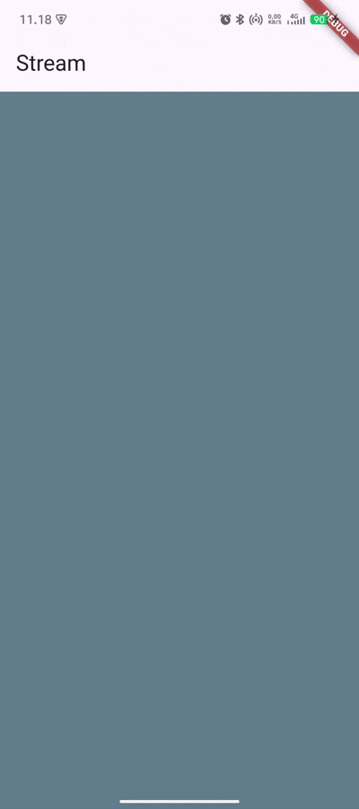
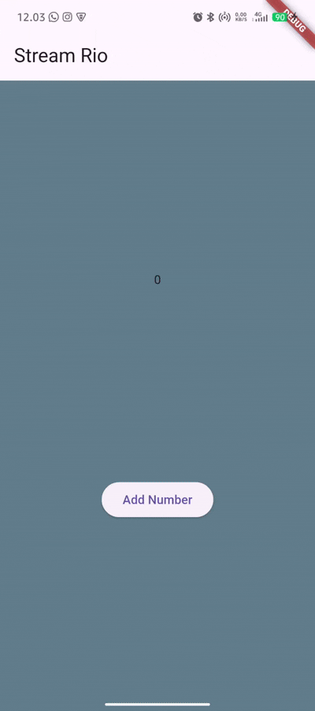

# README - Laporan Praktikum Flutter: State Management dengan Streams (Week 12)

## Identitas

- **Nama:** Satrio Ahmad Ramadhani
- **NIM:** 2341720163
- **Kelas:** Kelas T-3H

---

## Praktikum 1: Dart Streams

### Soal Praktikum

**Soal 1:**

- Tambahkan **nama panggilan Anda** pada `title` app sebagai identitas hasil pekerjaan Anda.
- Gantilah warna tema aplikasi sesuai kesukaan Anda.
  - dapat dilihat di demo

```dart
  title: const Text('Stream Rio'),
```

**Soal 2:**

- Tambahkan 5 warna lainnya sesuai keinginan Anda pada variabel `colors` tersebut.
  - dapat dilihat di demo


**Soal 3:**

- Jelaskan fungsi keyword `yield*` pada kode tersebut!
- Apa maksud isi perintah kode tersebut?
  - mengambil generator lain ke dalam generator

**Soal 4:**

- Capture hasil praktikum Anda berupa GIF dan lampirkan di README.



**Soal 5:**

- Jelaskan perbedaan menggunakan `listen` dan `await for` (langkah 9)!
  - listen melakukan pembaruan data secara terus menerus,
  - await for memroses data sesuai urutan.

### Code Final

**main.dart:**

```dart
import 'package:flutter/material.dart';
import 'stream.dart';

void main() {
  runApp(const MyApp());
}

class MyApp extends StatelessWidget {
  const MyApp({super.key});

  @override
  Widget build(BuildContext context) {
    return MaterialApp(
      title: 'Stream',
      theme: ThemeData(
        primarySwatch: Colors.deepPurple,
      ),
      home: const StreamHomePage(),
    );
  }
}

class StreamHomePage extends StatefulWidget {
  const StreamHomePage({super.key});

  @override
  State<StreamHomePage> createState() => _StreamHomePageState();
}

class _StreamHomePageState extends State<StreamHomePage> {
  Color bgColor = Colors.blueGrey;
  late ColorStream colorStream;

  @override
  void initState() {
    super.initState();
    colorStream = ColorStream();
    changeColor();
  }

  void changeColor() async {
    await for (var eventColor in colorStream.getColors()) {
      setState(() {
        bgColor = eventColor;
      });
    }
  }

  @override
  Widget build(BuildContext context) {
    return Scaffold(
      appBar: AppBar(
        title: const Text('Stream'),
      ),
      body: Container(
        decoration: BoxDecoration(color: bgColor),
      ),
    );
  }
}

```

**stream.dart:**

```dart
import 'package:flutter/material.dart';

class ColorStream {
  final List<Color> colors = [
    Colors.blueGrey,
    Colors.amber,
    Colors.deepPurple,
    Colors.lightBlue,
    Colors.teal,
  ];

  Stream<Color> getColors() async* {
    yield* Stream.periodic(const Duration(seconds: 1), (int t) {
      int index = t % colors.length;
      return colors[index];
    });
  }
}
```

---

## Praktikum 2: Stream Controllers dan Sinks

### Soal Praktikum

**Soal 6:**

- Jelaskan maksud kode langkah 8 dan 10 tersebut!
  - langkah 8 : penggunaan stream
  - langkah 10 : generate random number ke stream
- Capture hasil praktikum Anda berupa GIF dan lampirkan di README.



**Soal 7:**

- Jelaskan maksud kode langkah 13 sampai 15 tersebut!
  - langkah 13 membuat function addError()
  - langkah 15 mengubah menjadi menambahkan error di screen
- Kembalikan kode seperti semula pada Langkah 15, comment `addError()` agar Anda dapat melanjutkan ke praktikum 3 berikutnya.

### Code Final

**stream.dart (tambahan NumberStream class):**

```dart
import 'dart:async';

class NumberStream {
  final _streamController = StreamController<int>();

  void addNumberToSink(int number) {
    _streamController.sink.add(number);
  }

  Stream<int> get stream => _streamController.stream;

  void close() {
    _streamController.close();
  }
}
```

**main.dart (modifikasi pada initState dan tambah method):**

```dart
  int lastNumber = 0;
  late StreamController numberStreamController;
  late NumberStream numberStream;

  @override
  void initState() {
    numberStream = NumberStream();
    numberStreamController = numberStream.controller;
    Stream stream = numberStreamController.stream;
    stream.listen((event) {
      setState(() {
        lastNumber = event;
      });
    });
    super.initState();
  }

  @override
  void dispose() {
    numberStream.close();
    super.dispose();
  }

  void addRandomNumber() {
    Random random = Random();
    int myNum = random.nextInt(10);
    numberStream.addNumberToSink(myNum);
  }

  @override
  Widget build(BuildContext context) {
    return Scaffold(
      appBar: AppBar(title: const Text('Stream Rizqi')),
      body: SizedBox(
        width: double.infinity,
        child: Column(
          mainAxisAlignment: MainAxisAlignment.spaceEvenly,
          crossAxisAlignment: CrossAxisAlignment.center,
          children: [
            Text(lastNumber.toString()),
            ElevatedButton(onPressed: addRandomNumber, child: const Text('Add Number'))
          ],
        ),
      ),
    );
  }
```
---
