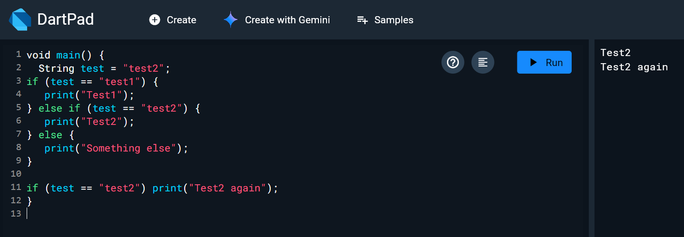
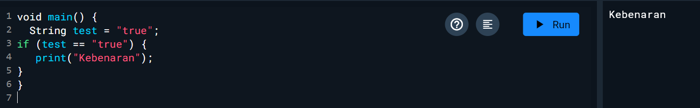
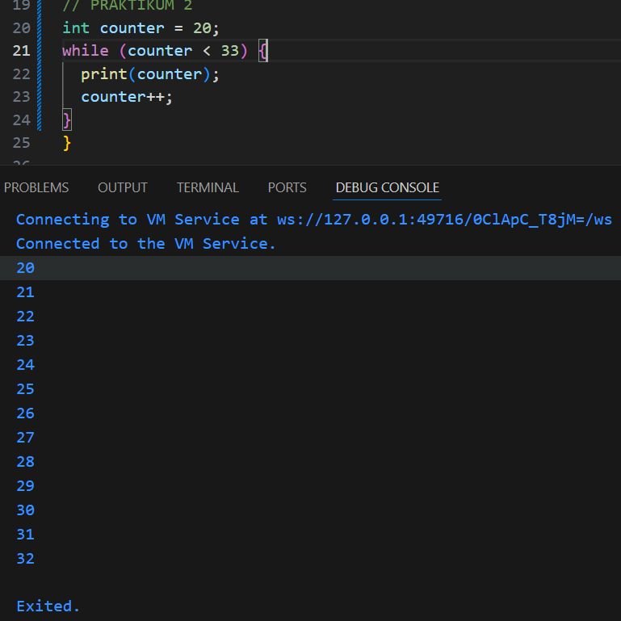
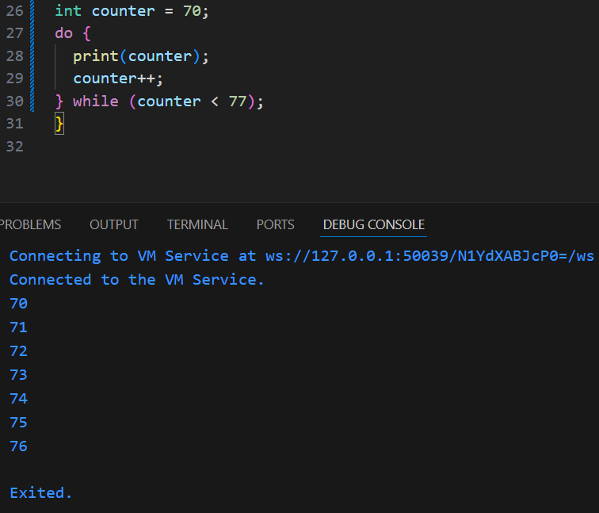
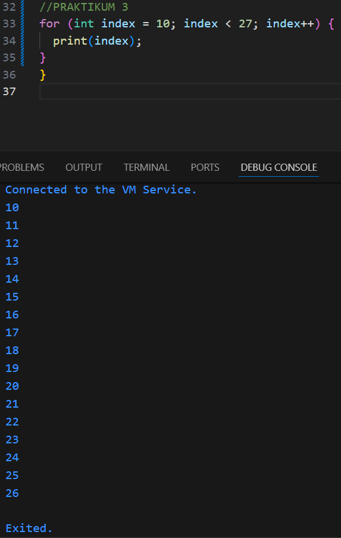
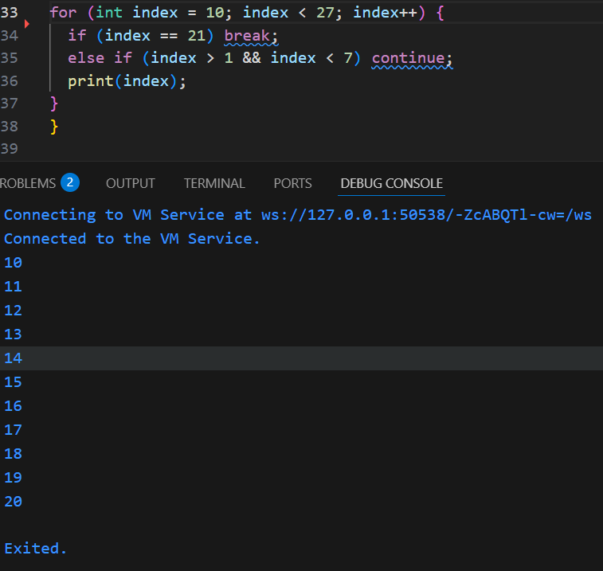

# Nama : satrio Ahmad Ramadhani
# NIM : 2341720163
# Kelas : 3H


# Praktikum 1: Menerapkan Control Flows ("if/else")

Langkah 1:
Ketik atau salin kode program berikut ke dalam fungsi main().

```dart
void main() {
  String test = "test2";
if (test == "test1") {
   print("Test1");
} else if (test == "test2") {
   print("Test2");
} else {
   print("Something else");
}

if (test == "test2") print("Test2 again");
}
```
hasil: 



Langkah 2:
Silakan coba eksekusi (Run) kode pada langkah 1 tersebut. Apa yang terjadi? Jelaskan!

ada dua Test2 karena ada dua pernyataan if pada code tersebut yang ber parameter test = test2l


Langkah 3:
Tambahkan kode program berikut, lalu coba eksekusi (Run) kode Anda.

```dart
String test = "true";
if (test) {
   print("Kebenaran");
}
```

Apa yang terjadi ? Jika terjadi error, silakan perbaiki namun tetap menggunakan if/else.

jawab: Error karena test bukan tipe data boolean, untuk perbaikan dapat menambahkan dua sama dengan seperti ini




# Praktikum 2: Menerapkan Perulangan "while" dan "do-while"

Langkah 1:
Ketik atau salin kode program berikut ke dalam fungsi main().
```dart
while (counter < 33) {
  print(counter);
  counter++;
}
```

Langkah 2:
Silakan coba eksekusi (Run) kode pada langkah 1 tersebut. Apa yang terjadi? Jelaskan! Lalu perbaiki jika terjadi error.
jawaban: Error dikarenakan counter is undefined yang mengakibatkan counter tidak memiliki parameter

Hasil perbaikan = 

Langkah 3: Tambahkan kode program berikut, lalu coba eksekusi (Run) kode Anda.
```dart
do {
  print(counter);
  counter++;
} while (counter < 77);
```

Jawaban: Error dikarenakan counter is undefined yang mengakibatkan counter tidak memiliki parameter

Hasil Perbaikan = 

# Praktikum 3: Menerapkan Perulangan "for" dan "break-continue"

Langkah 1:
Ketik atau salin kode program berikut ke dalam fungsi main().
```dart
for (Index = 10; index < 27; index) {
  print(Index);
}
```
Langkah 2:
Silakan coba eksekusi (Run) kode pada langkah 1 tersebut. Apa yang terjadi? Jelaskan! Lalu perbaiki jika terjadi error.

Jawaban: Error dikarenakan tidak adanya sebuah parameter penentu tipe data dan tidak adanya postfix increment
Hasil perbaikan: 

Langkah 3:
Tambahkan kode program berikut di dalam for-loop, lalu coba eksekusi (Run) kode Anda.
```dart
If (Index == 21) break;
Else If (index > 1 || index < 7) continue;
print(index);
```

Apa yang terjadi ? Jika terjadi error, silakan perbaiki namun tetap menggunakan for dan break-continue.

Jawaban : Error, dikarenakan ada continue dan break diluar perulangan

Hasil Perubahan : 

# Tugas Praktikum
```dart
void main() {
  String nim = "2341720163 - Satrio Ahmad Ramadhani";

  for (int index = 0; index <= 201; index++) {
    bool adalahPrima = true;

    if (index <= 1) {
      adalahPrima = false;
    } else {
      for (int i = 2; i * i <= index; i++) {
        if (index % i == 0) {
          adalahPrima = false; 
          break; 
        }
      }
    }

    if (adalahPrima) {
      print("Prima (${index}): ${nim}");
    } else {
      print(index);
    }
  }
}
```

Hasil: 