# Nama : Satrio Ahmad Ramadhani
# NIM : 2341720163
# No Absen : 27 
# Jobsheet 4 - Collection, Records,dan Functions di Dart

## Praktikum 1: Eksperimen Tipe Data List
Selesaikan langkah-langkah praktikum berikut ini menggunakan VS Code atau Code Editor favorit Anda.

### Langkah 1:
Ketik atau salin kode program berikut ke dalam void main().

```dart
var list = [1, 2, 3];
assert(list.length == 3);
assert(list[1] == 2);
print(list.length);
print(list[1]);

list[1] = 1;
assert(list[1] == 1);
print(list[1]);
```

### Langkah 2:
Silakan coba eksekusi (Run) kode pada langkah 1 tersebut. Apa yang terjadi? Jelaskan!


Kode ini melakukan demonstrasi cara membuat list, mengakses, dan memodifikasi list pada dart

### Langkah 3:
Ubah kode pada langkah 1 menjadi variabel final yang mempunyai index = 5 dengan default value = null. Isilah nama dan NIM Anda pada elemen index ke-1 dan ke-2. Lalu print dan capture hasilnya.

Apa yang terjadi ? Jika terjadi error, silakan perbaiki.


## Praktikum 2: Eksperimen Tipe Data Set
Selesaikan langkah-langkah praktikum berikut ini menggunakan VS Code atau Code Editor favorit Anda.

### Langkah 1:
Ketik atau salin kode program berikut ke dalam fungsi main().

```dart
var halogens = {'fluorine', 'chlorine', 'bromine', 'iodine', 'astatine'};
print(halogens);
```

### Langkah 2:
Silakan coba eksekusi (Run) kode pada langkah 1 tersebut. Apa yang terjadi? Jelaskan! Lalu perbaiki jika terjadi error.

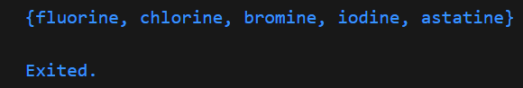

### Langkah 3:
Tambahkan kode program berikut, lalu coba eksekusi (Run) kode Anda.

```dart
var names1 = <String>{};
Set<String> names2 = {}; // This works, too.
var names3 = {}; // Creates a map, not a set.

print(names1);
print(names2);
print(names3);
```

Apa yang terjadi ? Jika terjadi error, silakan perbaiki namun tetap menggunakan ketiga variabel tersebut. Tambahkan elemen nama dan NIM Anda pada kedua variabel Set tersebut dengan dua fungsi berbeda yaitu .add() dan .addAll(). Untuk variabel Map dihapus, nanti kita coba di praktikum selanjutnya

yang terjadi adalah kita melakukan print dataset kosong

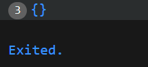

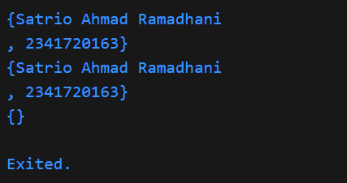


## Praktikum 3: Eksperimen Tipe Data Maps
Selesaikan langkah-langkah praktikum berikut ini menggunakan VS Code atau Code Editor favorit Anda.

### Langkah 1:
Ketik atau salin kode program berikut ke dalam fungsi main().

``` dart
var gifts = {
  // Key:    Value
  'first': 'partridge',
  'second': 'turtledoves',
  'fifth': 1
};

var nobleGases = {
  2: 'helium',
  10: 'neon',
  18: 2,
};

print(gifts);
print(nobleGases);
```

### Langkah 2:
Silakan coba eksekusi (Run) kode pada langkah 1 tersebut. Apa yang terjadi? Jelaskan! Lalu perbaiki jika terjadi error.

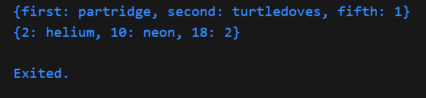

pada code ini kita mendemonstrasikan cara membuat dan menampilkan map di dart, dimana key dan value bisa menggunakan tipedata yang berbeda

Langkah 3:
Tambahkan kode program berikut, lalu coba eksekusi (Run) kode Anda.

```dart
var mhs1 = Map<String, String>();
gifts['first'] = 'partridge';
gifts['second'] = 'turtledoves';
gifts['fifth'] = 'golden rings';

var mhs2 = Map<int, String>();
nobleGases[2] = 'helium';
nobleGases[10] = 'neon';
nobleGases[18] = 'argon';
```

Apa yang terjadi ? Jika terjadi error, silakan perbaiki.
variable mhs1 dan mhs2 saat melakukan print tidak mengeluarkan apa apa


Tambahkan elemen nama dan NIM Anda pada tiap variabel di atas (gifts, nobleGases, mhs1, dan mhs2).

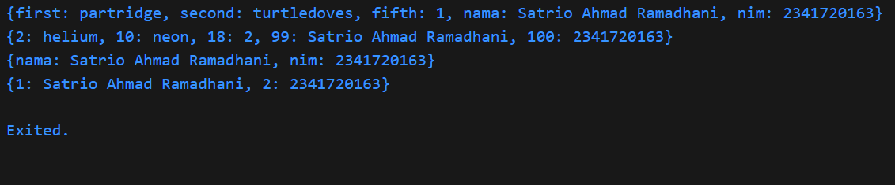


## Praktikum 4: Eksperimen Tipe Data List: Spread dan Control-flow Operators
Selesaikan langkah-langkah praktikum berikut ini menggunakan VS Code atau Code Editor favorit Anda.

### Langkah 1:
Ketik atau salin kode program berikut ke dalam fungsi main().

```dart
var list = [1, 2, 3];
var list2 = [0, ...list];
print(list1);
print(list2);
print(list2.length);
```

### Langkah 2:
Silakan coba eksekusi (Run) kode pada langkah 1 tersebut. Apa yang terjadi? Jelaskan! Lalu perbaiki jika terjadi error.

pada code ini kita membuat list dimana list2 dapat menggunakan data pada list untuk mengisi didalamnya 

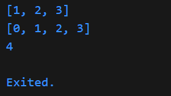

### Langkah 3:
Tambahkan kode program berikut, lalu coba eksekusi (Run) kode Anda.
```dart
list1 = [1, 2, null];
print(list1);
var list3 = [0, ...?list1];
print(list3.length);
```

Apa yang terjadi ? Jika terjadi error, silakan perbaiki.

kita melakukan print dengan null aware operator dimana hasil print hanya 1, 2, dan null saja dengan length 4 karena 0 juga termsuk null

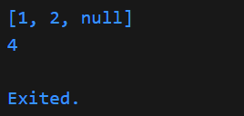

Tambahkan variabel list berisi NIM Anda menggunakan Spread Operators. Dokumentasikan hasilnya dan buat laporannya!

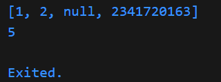

### Langkah 4:
Tambahkan kode program berikut, lalu coba eksekusi (Run) kode Anda.
```dart
var nav = ['Home', 'Furniture', 'Plants', if (promoActive) 'Outlet'];
print(nav);
```
Apa yang terjadi ? Jika terjadi error, silakan perbaiki. Tunjukkan hasilnya jika variabel promoActive ketika true dan false.

Error, dimana untuk memperbaiki kita harus mendeklarasikan promoActive dengan tipedata boolean

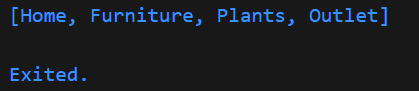

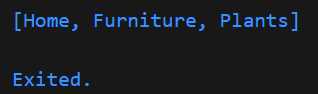

### Langkah 5:
Tambahkan kode program berikut, lalu coba eksekusi (Run) kode Anda.
```dart
var nav2 = ['Home', 'Furniture', 'Plants', if (login case 'Manager') 'Inventory'];
print(nav2);
```
Apa yang terjadi ? Jika terjadi error, silakan perbaiki. Tunjukkan hasilnya jika variabel login mempunyai kondisi lain.

Error, dimana untuk perbaikan kita perlu menambahkan variable login sebelum nav2

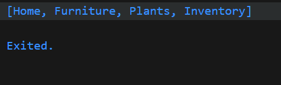

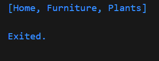

### Langkah 6:
Tambahkan kode program berikut, lalu coba eksekusi (Run) kode Anda.
```dart
var listOfInts = [1, 2, 3];
var listOfStrings = ['#0', for (var i in listOfInts) '#$i'];
assert(listOfStrings[1] == '#1');
print(listOfStrings);
```
Apa yang terjadi ? Jika terjadi error, silakan perbaiki. Jelaskan manfaat Collection For dan dokumentasikan hasilnya.

pada code ini kita menggunakan collection for untuk menambahkan '#' pada angka di dalam list

Manfaat collection-for di Dart adalah memudahkan pembuatan list (atau set/map) baru dari hasil iterasi koleksi lain secara ringkas dan efisien.

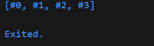

## Praktikum 5: Eksperimen Tipe Data Records

### Langkah 1:
Ketik atau salin kode program berikut ke dalam fungsi main().

```dart
var record = ('first', a: 2, b: true, 'last');
print(record)
```

### Langkah 2:
Silakan coba eksekusi (Run) kode pada langkah 1 tersebut. Apa yang terjadi? Jelaskan! Lalu perbaiki jika terjadi error.

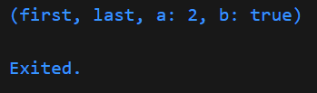

### Langkah 3:
Tambahkan kode program berikut di luar scope void main(), lalu coba eksekusi (Run) kode Anda.

```dart
(int, int) tukar((int, int) record) {
  var (a, b) = record;
  return (b, a);
}
```

Apa yang terjadi ? Jika terjadi error, silakan perbaiki. Gunakan fungsi tukar() di dalam main() sehingga tampak jelas proses pertukaran value field di dalam Records.

tidak terjadi apa apa


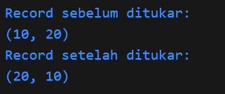

### Langkah 4:
Tambahkan kode program berikut di dalam scope void main(), lalu coba eksekusi (Run) kode Anda.

```dart
(String, int) mahasiswa;
print(mahasiswa);
```

Apa yang terjadi ? Jika terjadi error, silakan perbaiki. Inisialisasi field nama dan NIM Anda pada variabel record mahasiswa di atas. Dokumentasikan hasilnya dan buat laporannya!

Error, dimana untuk perbaikan error adalah untuk melakukan deklarasi nilai untuk mahasiswa

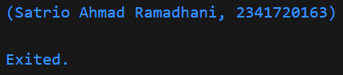

### Langkah 5:
Tambahkan kode program berikut di dalam scope void main(), lalu coba eksekusi (Run) kode Anda.

```dart
var mahasiswa2 = ('first', a: 2, b: true, 'last');

print(mahasiswa2.$1); // Prints 'first'
print(mahasiswa2.a); // Prints 2
print(mahasiswa2.b); // Prints true
print(mahasiswa2.$2); // Prints 'last'
```

Apa yang terjadi ? Jika terjadi error, silakan perbaiki. Gantilah salah satu isi record dengan nama dan NIM Anda

kita melakukan print sesuai dengan urutan dari variable bukan dari elemen positional

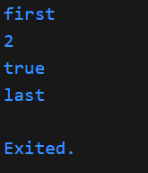

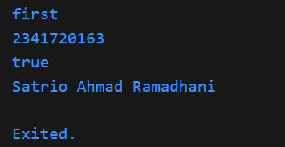


### Tugas Praktikum
1. Silakan selesaikan Praktikum 1 sampai 5, lalu dokumentasikan berupa screenshot hasil  pekerjaan Anda beserta penjelasannya!
2. Jelaskan yang dimaksud Functions dalam bahasa Dart!
    Functions dalam bahasa Dart adalah blok kode yang dapat digunakan kembali untuk menjalankan tugas tertentu. Function menerima input (parameter), melakukan proses, dan dapat mengembalikan output (nilai).
3. Jelaskan jenis-jenis parameter di Functions beserta contoh sintaksnya!
    Positional Parameter (Parameter Posisi)
    ```dart
    void sapa(String nama, int umur) {
    print('Halo $nama, umur Anda $umur');
    }
    ```
    Parameter yang urutannya harus sesuai saat pemanggilan fungsi.
    Optional Positional Parameter (Parameter Posisi Opsional)
    ```dart
    void sapa(String nama, [int? umur]) {
    print('Halo $nama, umur Anda $umur');
    }
    ```
    Ditulis dalam tanda kurung siku [], boleh diisi atau tidak.
    Named Parameter (Parameter Bernama)
    ```dart
    void sapa({required String nama, int umur = 0}) {
    print('Halo $nama, umur Anda $umur');
    }
    ```
    Ditulis dalam tanda kurung kurawal {} dan harus disebutkan namanya saat pemanggilan.
    Default Parameter Value (Nilai Default)
    ```dart
    void sapa(String nama, [int umur = 18]) {
    print('Halo $nama, umur Anda $umur');
    }
    ```
    Parameter opsional (posisi atau bernama) bisa diberi nilai default.

4. Jelaskan maksud Functions sebagai first-class objects beserta contoh sintaknya!
    Functions sebagai first-class objects di Dart berarti fungsi dapat diperlakukan seperti nilai/data lain: bisa disimpan dalam variabel, dikirim sebagai parameter, atau dikembalikan dari fungsi lain.

    ```dart
    void sapa() {
    print('Halo!');
    }
    var f = sapa;
    f(); // Memanggil fungsi lewat variabel

    // Mengirim fungsi sebagai parameter
    void jalankan(Function fn) {
    fn();
    }
    jalankan(sapa);

    // Mengembalikan fungsi dari fungsi lain
    Function buatSapa() {
    return () => print('Hai!');
    }
    var fnSapa = buatSapa();
    fnSapa();
    ```
5. Apa itu Anonymous Functions? Jelaskan dan berikan contohnya!
    Anonymous Functions (fungsi anonim) di Dart adalah fungsi yang tidak memiliki nama. Fungsi ini biasanya digunakan sebagai argument pada fungsi lain, atau untuk operasi sederhana yang hanya dipakai sekali.

    ```dart
    var list = [1, 2, 3];
    list.forEach((item) {
        print(item);
    });
    ```
6. Jelaskan perbedaan Lexical scope dan Lexical closures! Berikan contohnya!
    Lexical scope adalah aturan di mana variabel hanya bisa diakses di dalam blok kode (scope) tempat variabel itu dideklarasikan.

    Lexical closure adalah fungsi yang “membawa” variabel dari scope di mana fungsi itu dibuat, sehingga bisa mengakses variabel di luar dirinya meskipun sudah berada di scope lain.

    ```dart
    // Lexical Scope
    void main() {
    var nama = 'Satrio';
    void tampilNama() {
      print(nama); // Bisa akses 'nama' karena masih dalam scope main
    }
    tampilNama();
    }
    ```

    ```dart
    // Lexical Closure
    Function buatCounter() {
      int count = 0;
      return () {
        count++;
        print(count);
      };
    }

    void main() {
      var counter = buatCounter();
      counter(); // 1
      counter(); // 2
    }
    ```
    
7. Jelaskan dengan contoh cara membuat return multiple value di Functions!

    ```dart
      (String, int) getData() {
      String nama = 'Satrio';
      int nim = 2341720163;
      return (nama, nim);
      }

      void main() {
      var hasil = getData();
      print('Nama: ${hasil.$1}, NIM: ${hasil.$2}');
      }
    ```

    Untuk mengembalikan (return) lebih dari satu nilai dari sebuah function di Dart, kita bisa menggunakan record, list, atau map. Cara paling modern dan mudah dibaca adalah dengan record.
