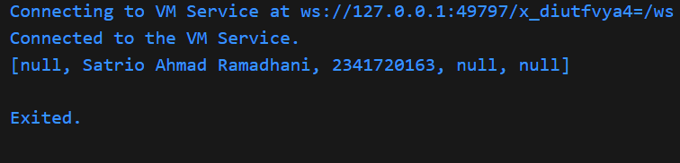

# Nama : Satrio Ahmad Ramadhani
# NIM : 2341720163
# No Absen : 27 

2. Praktikum 1: Eksperimen Tipe Data List
Selesaikan langkah-langkah praktikum berikut ini menggunakan VS Code atau Code Editor favorit Anda.

Langkah 1:
Ketik atau salin kode program berikut ke dalam void main().

```
var list = [1, 2, 3];
assert(list.length == 3);
assert(list[1] == 2);
print(list.length);
print(list[1]);

list[1] = 1;
assert(list[1] == 1);
print(list[1]);
```

Langkah 2:
Silakan coba eksekusi (Run) kode pada langkah 1 tersebut. Apa yang terjadi? Jelaskan!


Kode ini melakukan demonstrasi cara membuat list, mengakses, dan memodifikasi list pada dart

Langkah 3:
Ubah kode pada langkah 1 menjadi variabel final yang mempunyai index = 5 dengan default value = null. Isilah nama dan NIM Anda pada elemen index ke-1 dan ke-2. Lalu print dan capture hasilnya.

Apa yang terjadi ? Jika terjadi error, silakan perbaiki.

