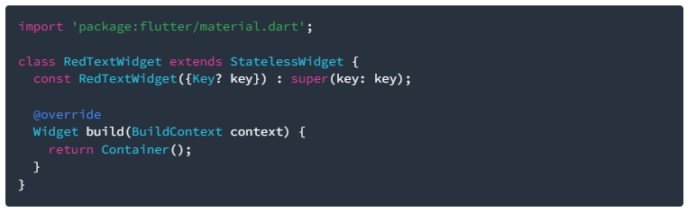
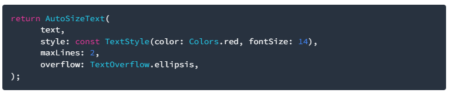
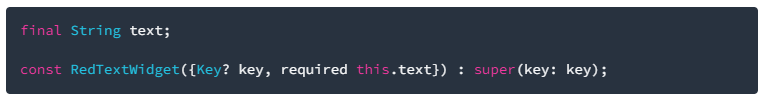
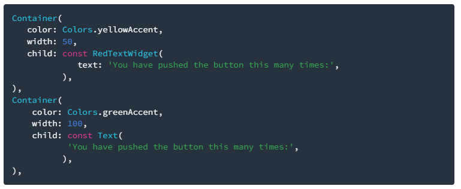

# Jobsheet 7

## Praktikum

### Langkah 1: Buat Project Baru
Buatlah sebuah project flutter baru dengan nama flutter_plugin_pubdev. Lalu jadikan repository di GitHub Anda dengan nama flutter_plugin_pubdev.

### Langkah 2: Menambahkan Plugin
Tambahkan plugin auto_size_text menggunakan perintah berikut di terminal

Jika berhasil, maka akan tampil nama plugin beserta versinya di file pubspec.yaml pada bagian dependencies.

### Langkah 3: Buat file red_text_widget.dart
Buat file baru bernama red_text_widget.dart di dalam folder lib lalu isi kode seperti berikut.

### Langkah 4: Tambah Widget AutoSizeText
Masih di file red_text_widget.dart, untuk menggunakan plugin auto_size_text, ubahlah kode return Container() menjadi seperti berikut.

Setelah Anda menambahkan kode di atas, Anda akan mendapatkan info error. Mengapa demikian? Jelaskan dalam laporan praktikum Anda!

### Langkah 5: Buat Variabel text dan parameter di constructor
Tambahkan variabel text dan parameter di constructor seperti berikut.

### Langkah 6: Tambahkan widget di main.dart
Buka file main.dart lalu tambahkan di dalam children: pada class _MyHomePageState

Run aplikasi tersebut dengan tekan F5, maka hasilnya akan seperti berikut.

## Tugas Praktikum

### 2. Jelaskan Maksud dari Langkah 2 pada Praktikum
Langkah 2 biasanya adalah menginstal atau menambahkan plugin ke project Flutter melalui file pubspec.yaml.
Hal ini bertujuan agar plugin dapat digunakan pada source code proyek Flutter-mu. Proses ini akan mendownload dependensi dari repository plugin yang ditentukan.

### 3. Jelaskan Maksud dari Langkah 5 pada Praktikum
Langkah 5 umumnya adalah melakukan implementasi plugin pada kode, misal dengan memanggil widget/plugin yang sudah dipasang pada tampilan aplikasi.
Tujuannya adalah agar fitur dari plugin tersebut (misal, pengaturan ukuran teks secara otomatis) bisa digunakan dan diuji pada aplikasi Flutter, baik di emulator maupun perangkat sungguhan.

### 4. Penjelasan Fungsi dan Perbedaan Dua Widget pada Langkah 6
Dua widget yang ditambahkan bisa saja widget original Text dan widget plugin, misal AutoSizeText.
Fungsi Text adalah menampilkan teks dengan ukuran tetap, sedangkan AutoSizeText adalah menampilkan teks yang otomatis menyesuaikan ukuran font agar muat pada area tertentu.
Perbedaan:
Text statis: jika teks kepanjangan, bisa saja terpotong atau keluar area
AutoSizeText dinamis: ukuran font menyesuaikan area, teks tidak terpotong.

### 5. Jelaskan maksud dari tiap parameter yang ada di dalam plugin `auto_size_text` !
- Berikut penjelasan parameter penting auto_size_text [dari dokumentasi resmi]:​
- textKey: Mengatur key untuk widget Text yang dihasilkan.
- style: Mengatur gaya teks (font, warna, dll).
- minFontSize: Ukuran minimum font saat auto resizing.
- maxFontSize: Ukuran maksimum font saat auto resizing.
- stepGranularity: Langkah/interval pengurangan font size saat menyesuaikan.
- presetFontSizes: Memaksa font size mengikuti list preset tertentu dan mengabaikan min/max.
- group: Sinkronisasi beberapa AutoSizeText agar ukuran fontnya sama-sama menyesuaikan anggota dengan font terkecil.
- textAlign: Alignment horizontal.
- textDirection: Arah text, misal LTR atau RTL.
- locale: Menentukan locale/font jika karakter Unicode berbeda.
- softWrap: Memutus di line break lunak.
- wrapWords: Mengatur pemisahan kata di baris baru, default true.
- overflow: Cara menangani overflow visual.
- overflowReplacement: Widget pengganti jika ada overflow.
- textScaleFactor: Rasio skala font.
- maxLines: Batas maksimal jumlah baris.
- semanticsLabel: Label aksesibilitas untuk teks.